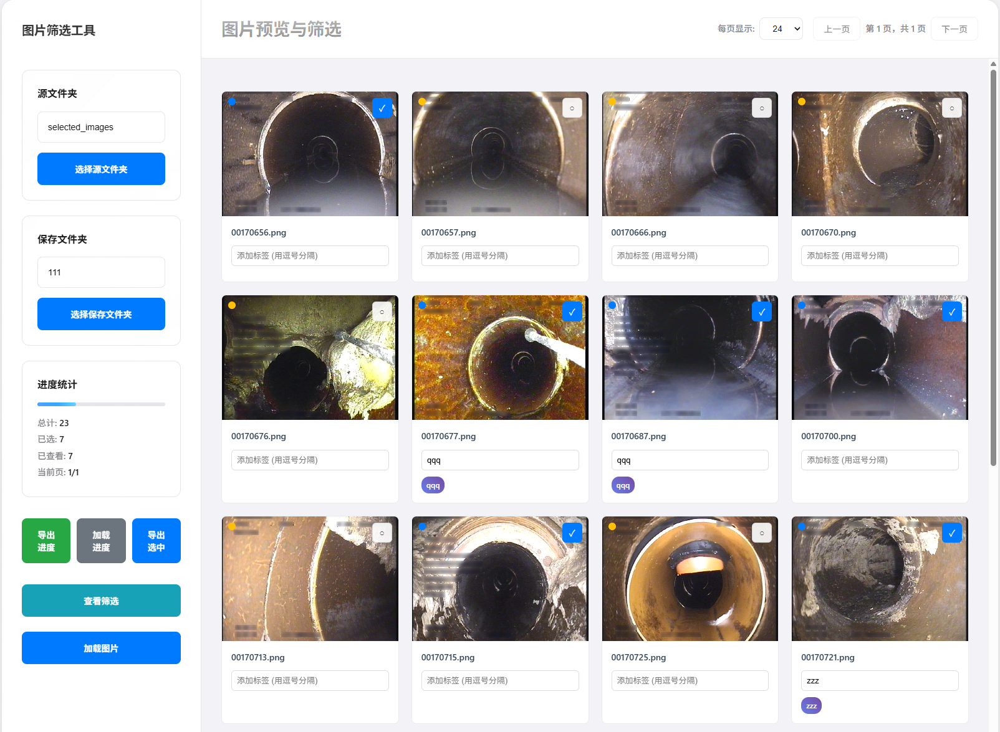
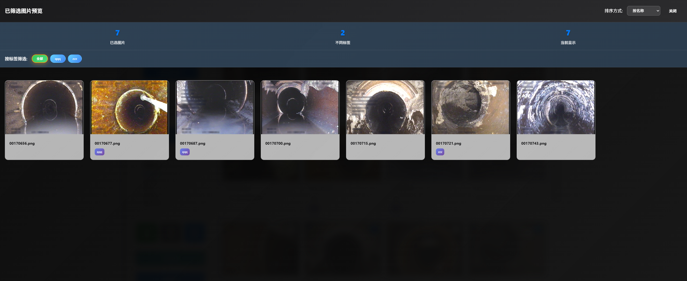

# 图片删选工具 

本项目起源是为了帮助解决管网CCTV监测中大量照片文件的初步筛选需求，核心代码基于Claude4生成





## ✨ 主要特性

### 📁 文件管理
- **智能文件夹选择**：支持源文件夹和保存文件夹分别管理
- **实时文件复制**：选中图片即时复制到保存文件夹
- **自动路径记录**：完整路径保存，支持项目恢复
- **批量文件处理**：高效的批量图片处理机制

### 🖼️ 图片预览
- **高质量预览**：支持 JPG、PNG、GIF、WebP、BMP 等主流格式
- **响应式网格布局**：自适应不同屏幕尺寸
- **分页浏览**：可配置每页显示数量（12/24/36/48张）
- **平滑动画**：优雅的页面切换和悬停效果

### 🏷️ 标签系统
- **实时标签添加**：为每张图片添加自定义标签
- **智能标签筛选**：按标签快速筛选已选图片
- **标签统计分析**：查看标签使用情况和分布
- **标签导入导出**：支持标签数据的完整保存

### 💾 进度管理
- **自动保存**：智能防抖保存，避免频繁写入
- **进度导出**：JSON 格式导出筛选进度
- **项目恢复**：支持从进度文件恢复工作状态
- **批量更新**：优化的批量数据更新机制

### 📊 数据统计
- **实时统计**：总数/已选/已查看数量实时显示
- **进度条显示**：可视化的筛选进度
- **分页信息**：当前页面位置和总页数
- **详细报告**：筛选结果的详细统计信息


## 🚀 快速开始


### 使用方法

1. **打开工具**
   ```bash
   # 直接在浏览器中打开 HTML 文件
   ```

2. **选择文件夹**
   - 点击"选择源文件夹"，选择包含图片的文件夹
   - 点击"选择保存文件夹"，选择筛选后图片的保存位置
   - 点击"加载图片"开始扫描加载图片

3. **筛选图片**
   - 浏览图片预览
   - 点击"✓"按钮选择喜欢的图片
   - 为图片添加标签（用逗号分隔）
   - 选中的图片会自动复制到保存文件夹

4. **管理结果**
   - 点击"查看筛选"查看所有选中的图片
   - 使用标签筛选功能快速定位
   - 导出进度文件以备后续使用

## 📋 功能详解

### 文件夹管理
```
源文件夹：包含待筛选图片的文件夹
保存文件夹：筛选后图片的存储位置
```

### 图片操作
- **选中**：将图片标记为选中并复制到保存文件夹
- **取消选中**：从保存文件夹删除图片（需确认）
- **添加标签**：为图片添加描述性标签
- **状态指示**：新建/已选/已查看状态一目了然


### 进度保存
```json
{
  "projectName": "图片筛选项目",
  "createTime": "2025-01-01T00:00:00.000Z",
  "sourcePath": "源文件夹完整路径",
  "savePath": "保存文件夹完整路径",
  "selectedImages": [0, 1, 2],
  "imageTags": [[0, ["风景", "旅游"]]],
  "statistics": {
    "totalImages": 100,
    "selectedCount": 15,
    "viewedCount": 50
  }
}
```


